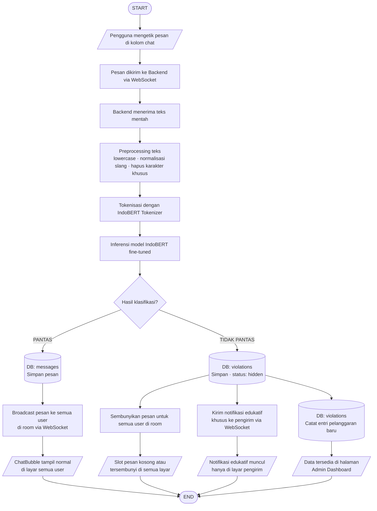
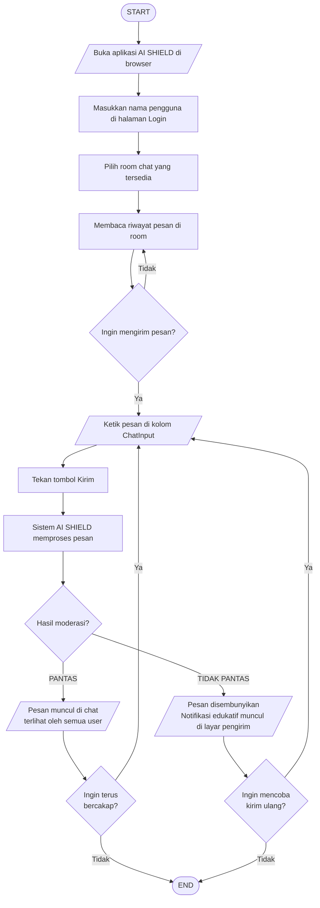
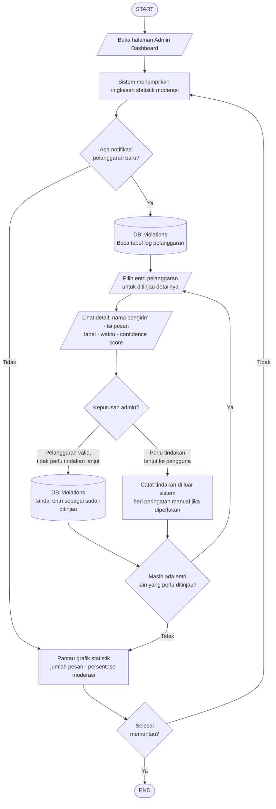
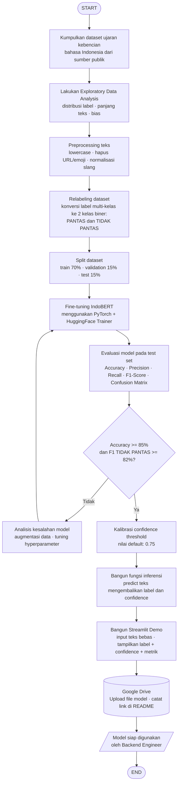
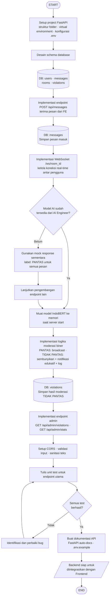
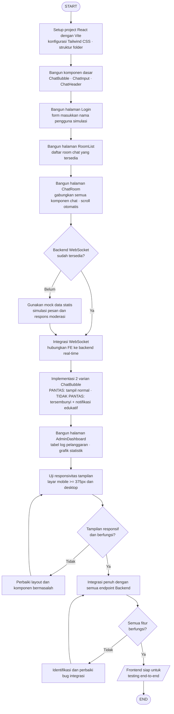

# Flowchart Alur Sistem — AI SHIELD

> Semua diagram menggunakan standar flowchart formal dengan simbol Start/End, proses, keputusan, input/output, dan database (silinder).

---

## 1. Alur Sistem Utama

Menggambarkan alur lengkap dari pesan dikirim pengguna hingga keputusan moderasi ditampilkan di antarmuka.

---

## 2. Alur Role: Pengguna Biasa

Menggambarkan langkah-langkah yang dialami oleh pengguna reguler saat berinteraksi dalam ruang chat.

---

## 3. Alur Role: Admin

Menggambarkan langkah-langkah yang dilakukan oleh admin dalam memantau dan meninjau hasil moderasi sistem.

---

## 4. Alur Proses Pengembangan: AI/ML Engineer

Menggambarkan alur kerja tim AI dalam membangun model IndoBERT dari pengumpulan data hingga model siap digunakan backend.

---

## 5. Alur Proses Pengembangan: Backend Engineer

Menggambarkan alur kerja Backend Engineer dalam membangun server API, WebSocket, dan integrasi model AI.

---

## 6. Alur Proses Pengembangan: Frontend Engineer

Menggambarkan alur kerja Frontend Engineer dalam membangun antarmuka chat dan dashboard admin.

